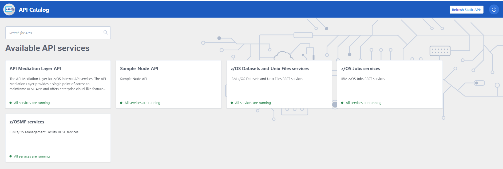
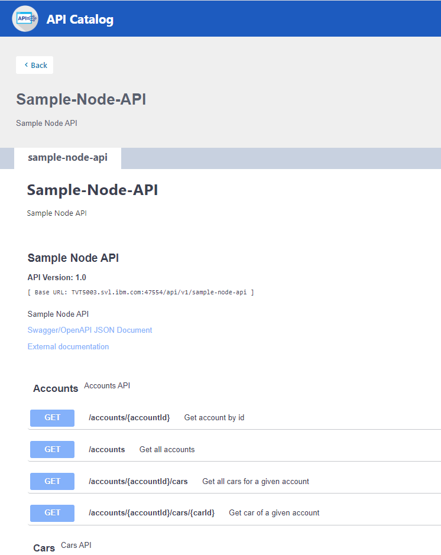
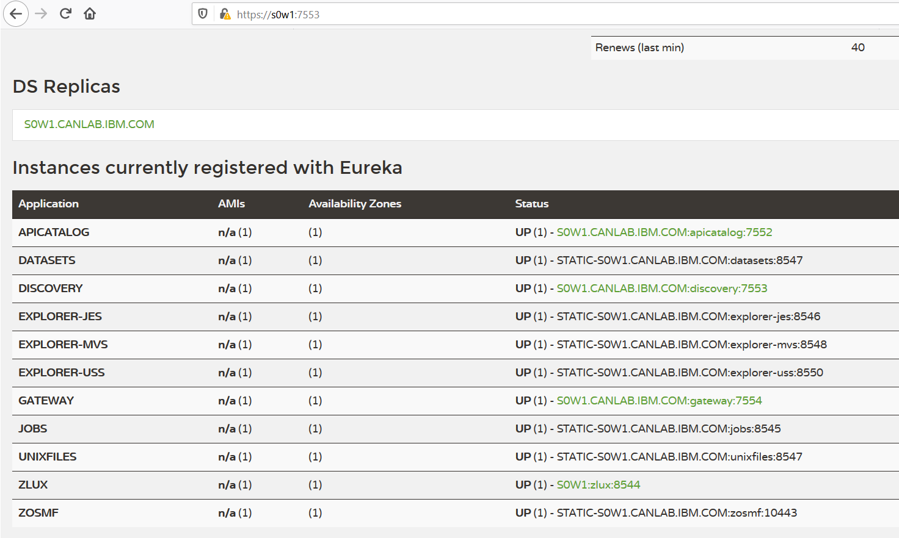

# sample-node-api  
A sample node js api for finding cars and accounts for a dealership,its used here to demonstrate the steps to extend API/ML with your own rest api.     

## Steps

**Note**  
`Only rest api with https support can be deployed behind API/ML, make sure to enable https support in your rest api.
`   
This sample express app, has https enabled already.    

## PART I: Download & Build on local

## Method 1: From github
### 1) Clone the repository, install node packages  and verify routes locally

``` 
//on local
git clone https://github.com/zowe/sample-node-api
cd sample-node-api
npm install
npm start
```

Open your local browser and verify the sample-node-api is working by accessing:     
`http://localhost:18000/accounts/`   
`http://localhost:18000/accounts/1`   
`http://localhost:18000/accounts/1/cars/`   


### 2) Transfer project files from local to remote host

**Note**  
The `node_modules` folder will not be transferred, we can do npm install later on remote server itself to pull down required node packages

```
cd sample-node-api
npm run build
scp -r dist ibmuser@my.mainframe.com:</usr/lpp/extender>/sample-node-api
```

For the next step, ensure that you have node installed on z/OS and your PATH includes nodejs/bin directory.

```
ssh ibmuser@my.mainframe.com
. ~/.profile - (Skip if you can already run "npm" on z/OS)
cd </usr/lpp/extender>/sample-node-api
npm install
```

## Method 2: From Artifactory
### 1) Download latest pax from artifactory
Get latest package from [artifactory](https://zowe.jfrog.io/artifactory/libs-snapshot-local/org/zowe/sample-node-api/1.0.0-SNAPSHOT)

Choose the latest pax build provided from the link above and download it into your local storage.

### 2) Transfer and unpax on z/OS
```
sftp ibmuser@mymainframe.ibm.com
put <pax-name>.pax
```

## PART II: Deploy with Zowe on server

### 1) login
```  
ssh ibmuser@my.mainframe.com       
```

### 2) install component using zowe-install-component.sh script
```
./<zowe-runtime-dir>/bin/zowe-install-component.sh -d <zowe-extensions-dir> -i <zowe-instance-dir> -o <component-file-path> -l <log-folder>
```
```
<zowe-extensions-dir> - Directory that will hold all external extensions installed onto zowe
<zowe-instance-dir> - Current installed Zowe's instance directory
<component-file-path> - The path to the component being installed (the component file transferred from local to z/OS in PART I)
<log-file> - Directory that will hold the logs of the component installation
```

### 3) Lifecycle scripts of the component

We expect following in service folder `start.sh`. In our case its bin folder with relevant scripts.

`start.sh` starts node app on configured port       
`env.sh` its custom script use to configure port for our node app, feel free to use your desired way         

### 4) Access newly deployed webservice

Please see static definition file `sample-node-api.yml`      
It configures service endpoint as `sample-node-api` with property `serviceId`     
We also provide api gateway base path `api\v1` with property `gatewayUrl` in same file.        


In effect, service can be accessed with following url:      
`https://{host}:{GATEWAY_PORT}/{gatewayUrl}/{serviceId}/*`    

where `GATEWAY_PORT` is configured in $INSTANCE_DIR/instance.env      

Verify by accessing following:      
`https://my.mainframe.com:7554/api/v1/sample-node-api/accounts/`            
`https://my.mainframe.com:7554/api/v1/sample-node-api/accounts/1/`            
`https://my.mainframe.com:7554/api/v1/sample-node-api/accounts/1/cars/`              

### 5) Registered With API Catalog

**API Catalog**




**Discovery Service Dashboard**

