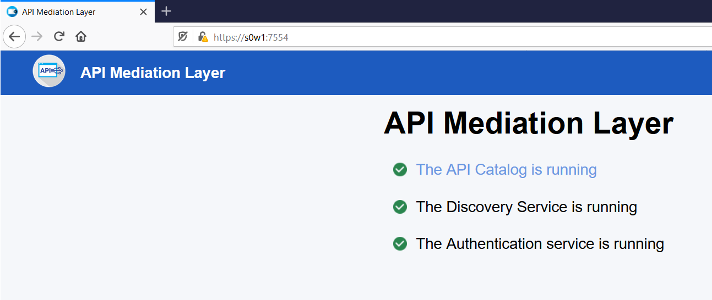
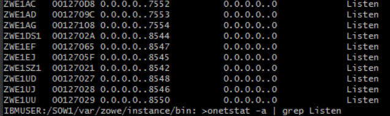

# How do we know zowe retarted succesfully?

1 : check in browser    

https://s0w1:7554    
https://s0w1:7554/ui/v1/apicatalog/ - try login and check

2: Check if all services are up or not
Zowe listen on 10 ports 
  - 8542, 8544, 8546, 8548, 8550 - these five start much earlier
  - 8545, 8547, 7552, 7553, 7554 - these five are java services - takes over 20 mins to restart
Login to zowe and check all open ports:
```
ssh s0w1
onetstat -a | grep Listen
```

you will see 10 open ports


3. Eureka Discovery Service Dashboard has 11 running services


4. Open Jes Explorer
filter on owner - ZWE*
```
#1 zss service started
ZWES1013I ZSS Server has started. Version '1.13.0+20200623'

#2 - JES Explorer UI
[JES] is started and listening on 8546...

#3 USS Explorer UI
[USS] is started and listening on 8550...

#4 MVS Explorer UI
[MVS] is started and listening on 8548...

#5 ZLUX
2020-08-10 06:26:49.307 <ZWED:66510> ZWESVUSR INFO (_zsf.install,index.js:340) ZWED0031I - Server is ready at https://0.0.0.0:8544, Plugins successfully loaded: 100% (20/20)

# 6 JobsAPI service is up
2020-08-10 06:40:53.432 <ZWEEAJ1:main:66500> ZWESVUSR INFO  (o.z.j.JesJobsApplication,StartupInfoLogger.java:59) Started JesJobsApplication in 872.68 seconds (JVM running for 1056.269)

#7 Datasets and Files API service is up
2020-08-10 06:41:13.974 <ZWEEAD1:main:66496> ZWESVUSR INFO  (o.z.DataSetsAndUnixFilesApplication,StartupInfoLogger.java:59) Started DataSetsAndUnixFilesApplication in 906.562 seconds (JVM running for 1073.875)

#8 Discovery Service is up

2020-08-10 06:44:33.386 <ZWEADS1:main:66493> ZWESVUSR INFO  (o.z.a.p.s.ServiceStartupEventHandler) ZWEAM000I Discovery Service has been started in 1275.604 seconds

#9 Catalog service is up

2020-08-10 06:45:34.765 <ZWEAAC1:main:66497> ZWESVUSR INFO  (o.z.a.p.s.ServiceStartupEventHandler) ZWEAM000I API Catalog Service has been started in 1336.094 seconds

#10 Gateway service is up

2020-08-10 06:45:43.711 <ZWEAGW1:main:66498> ZWESVUSR INFO  (o.z.a.p.s.ServiceStartupEventHandler) ZWEAM000I Gateway Service has been started in 1344.318 seconds

# 11 zlux eureka registeration with API ML

2020-08-10 06:57:29.815 <ZWED:66510> ZWESVUSR INFO (_zsf.apiml,apiml.js:218) ZWED0021I - Eureka Client Registered from 127.0.0.1. Available at https://S0W1.CANLAB.IBM.COM:7553/ui/v1/zlux/
ZWED5019I - Started
```